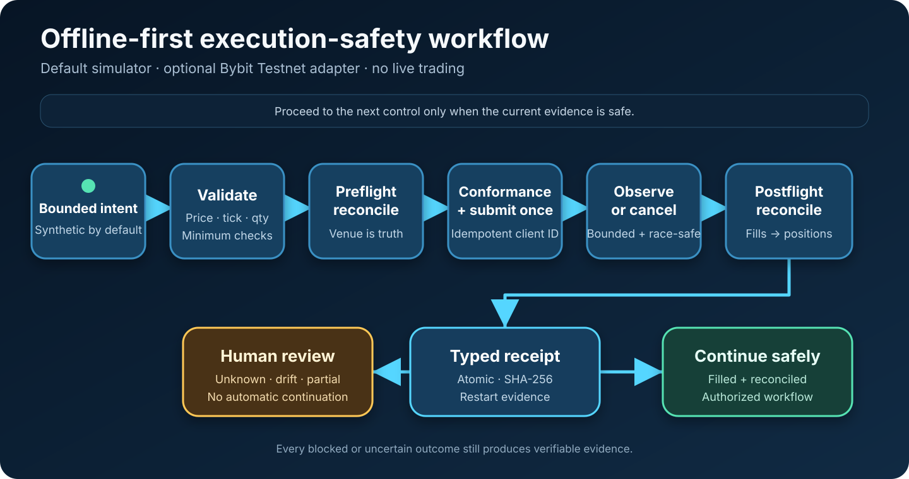

# Trade Execution Safety Lab

An offline Python lab that tests how order automation handles failures,
interruptions, and inconsistent provider data without using a live account or
trading strategy.



## Review this project in 3 minutes

No account or installation is required:

1. Scan the [failure scenarios](docs/scenarios.md).
2. Read [How it works](#how-it-works) and
   [Safety and limits](#safety-and-limits).
3. Open the [architecture](docs/architecture.md) or
   [automated checks](https://github.com/mccruz/trade-execution-safety-lab/actions)
   for implementation evidence.

The goal is not a trading result. The project shows how automation can reject
unsafe work, compare its records with a provider, recover after interruption,
and send uncertain outcomes to a person.

## How it works

1. Validate an order before it can be submitted.
2. Compare the local position with the simulated provider's position.
3. Submit with a stable identifier so a restart cannot create a duplicate.
4. Track fills, fees, cancellations, and provider responses.
5. Reconcile the final state after timeouts, races, or reconnects.
6. Write a verifiable receipt and require human review when the outcome remains
   uncertain.

## Failure scenarios

| Scenario | Expected behavior |
| --- | --- |
| Invalid order size | Reject it before submission |
| Position mismatch | Pause and reconcile with the provider |
| Restart after submission | Recover the existing order instead of duplicating it |
| Partial fill | Record the fill and defer the unresolved remainder |
| Fill during cancellation | Accept the provider's final state as authoritative |
| Cancellation timeout | Stop after limited checks and report uncertainty |
| Bad provider response | Reject malformed or contradictory data |
| Rate limit or interruption | Return a clear error without hidden retries |

Receipts are written as complete files and include a SHA-256 digest so later
changes can be detected.

## Two separate modes

### Offline simulator

The default mode is built in, credential-free, and network-disabled. It uses
fictional `DEMO-USD` orders and runs every scenario used in CI. It contains no
economic strategy, market data, or performance claim.

### Optional Bybit Testnet adapter

The optional adapter shows how the same safety checks can wrap an external SDK.
It is fixed to Bybit Testnet, linear products, and one-way position mode. There
is no mainnet option, live deployment command, or automatic environment switch.

Public CI uses a fake injected client and never authenticates or sends an order.
The [Testnet adapter guide](docs/connectors/bybit-testnet.md) documents the exact
boundary and limitations.

## Optional offline demo

Python 3.11 or newer is required:

```bash
git clone https://github.com/mccruz/trade-execution-safety-lab.git
cd trade-execution-safety-lab
python3 -m venv .venv
source .venv/bin/activate
python -m pip install --no-deps .
trade-safety-lab demo --output-dir demo-output --reset
```

A successful run reports eight completed scenarios with no network or
credentials. Open `demo-output/summary.md` for the readable report.

Useful review commands:

```bash
trade-safety-lab list-scenarios
trade-safety-lab list-connectors
trade-safety-lab verify-receipt demo-output/receipts/DEMO-FULL-FILL.json
```

The CLI removes old demo output only when it finds the lab's own marker. It
rejects broad paths, symbolic-link targets, and unrelated directories.

## Safety and limits

- The repository contains no trading strategy, production configuration, live
  account details, or profitability claims.
- The default demo cannot make network requests or place orders.
- Testnet behavior does not prove production readiness and can differ from
  mainnet.
- The authenticated Bybit path is not exercised in public CI.
- The simulator covers selected order and recovery risks, not every venue rule,
  order type, latency condition, or market behavior.
- Local receipt checks detect later file changes but are not externally signed
  or independently timestamped.

This project is an engineering demonstration, not financial advice, a backtest,
or a production trading system.

## Verification

```bash
python -m unittest discover -s tests -v
python -m compileall -q src tests
```

GitHub Actions runs the full offline demo and tests across supported Python
versions. A separate credential-free check installs the optional SDK and
confirms its fixed Testnet configuration without contacting the provider.

## Project guide

- [Failure scenarios](docs/scenarios.md)
- [Architecture and safety rules](docs/architecture.md)
- [Provider adapter contract](docs/connector-conformance.md)
- [Bybit Testnet boundary](docs/connectors/bybit-testnet.md)
- [Dependency review](docs/dependency-review.md)
- [Security policy](SECURITY.md)
- [Public/private boundary](docs/provenance.md)

## License

Code and original documentation are available under the [MIT License](LICENSE).
Private trading systems, configurations, data, research, strategies, and
operational details are excluded from this clean public project.
